# TradeScope AI — Entity Relationship Diagram (ERD)

> **Database:** Supabase PostgreSQL  
> **Schema:** All tables in `public` schema with Row Level Security (RLS)  
> **Standard Columns on most business tables:** `id (UUID PK)`, `created_at`, `updated_at`, `created_by`, `updated_by`, `version`  
> **Immutable tables (no soft delete):** Financial, Audit, Order-Event, Ledger tables — retained permanently  

---

## Complete Entity List (35 Tables)

### AUTH & USERS (3 tables)

#### AUTH_USERS
| Column | Type | Notes |
|---|---|---|
| id | UUID PK | From Supabase Auth |
| email | VARCHAR(255) | Unique |
| created_at | TIMESTAMPTZ | |
| last_sign_in_at | TIMESTAMPTZ | |

#### USER_PROFILES
| Column | Type | Notes |
|---|---|---|
| id | UUID PK | |
| auth_user_id | UUID FK → AUTH_USERS.id | 1:1 |
| client_code | VARCHAR(20) | Unique, e.g. "CL-8K21" |
| full_name | VARCHAR(255) | |
| phone | VARCHAR(30) | |
| country | VARCHAR(2) | ISO country code |
| base_currency | VARCHAR(3) | e.g. USD, EUR |
| timezone | VARCHAR(50) | e.g. "America/New_York" |
| status | VARCHAR(30) | pending_verification, active, restricted, suspended, closed |
| kyc_status | VARCHAR(30) | not_submitted, pending, approved, rejected |
| risk_disclosure_version | VARCHAR(20) | |
| terms_version | VARCHAR(20) | |
| created_at | TIMESTAMPTZ | |
| updated_at | TIMESTAMPTZ | |

#### KYC_PROFILES
| Column | Type | Notes |
|---|---|---|
| id | UUID PK | |
| user_id | UUID FK → USER_PROFILES.id | |
| status | VARCHAR(30) | pending, under_review, approved, rejected |
| risk_level | VARCHAR(20) | low, medium, high |
| submitted_at | TIMESTAMPTZ | |
| reviewed_at | TIMESTAMPTZ | |
| reviewed_by | UUID FK → USER_PROFILES.id | Admin who reviewed |
| rejection_reason | TEXT | |
| created_at | TIMESTAMPTZ | |
| updated_at | TIMESTAMPTZ | |

#### KYC_DOCUMENTS
| Column | Type | Notes |
|---|---|---|
| id | UUID PK | |
| kyc_profile_id | UUID FK → KYC_PROFILES.id | |
| document_type | VARCHAR(50) | passport, drivers_license, utility_bill, etc. |
| storage_path | VARCHAR(500) | Supabase Storage path |
| status | VARCHAR(30) | uploaded, verified, rejected |
| verified_at | TIMESTAMPTZ | |
| created_at | TIMESTAMPTZ | |

---

### RBAC (4 tables)

#### ROLES
| Column | Type | Notes |
|---|---|---|
| id | UUID PK | |
| code | VARCHAR(50) | Unique: super_admin, user_admin, finance_admin, risk_manager, compliance_admin, support_agent, auditor |
| name | VARCHAR(100) | |
| description | TEXT | |
| created_at | TIMESTAMPTZ | |

#### PERMISSIONS
| Column | Type | Notes |
|---|---|---|
| id | UUID PK | |
| code | VARCHAR(100) | Unique: e.g. "users.create", "withdrawals.approve" |
| name | VARCHAR(100) | |
| resource | VARCHAR(50) | users, trading, finance, ai, risk, etc. |
| action | VARCHAR(50) | create, read, update, delete, approve, etc. |
| created_at | TIMESTAMPTZ | |

#### USER_ROLES
| Column | Type | Notes |
|---|---|---|
| id | UUID PK | |
| user_id | UUID FK → USER_PROFILES.id | |
| role_id | UUID FK → ROLES.id | |
| assigned_by | UUID FK → USER_PROFILES.id | |
| created_at | TIMESTAMPTZ | |

#### ROLE_PERMISSIONS
| Column | Type | Notes |
|---|---|---|
| id | UUID PK | |
| role_id | UUID FK → ROLES.id | |
| permission_id | UUID FK → PERMISSIONS.id | |
| created_at | TIMESTAMPTZ | |

---

### TRADING ACCOUNTS (3 tables)

#### TRADING_ACCOUNTS
| Column | Type | Notes |
|---|---|---|
| id | UUID PK | |
| user_id | UUID FK → USER_PROFILES.id | |
| account_number | VARCHAR(20) | Unique |
| account_name | VARCHAR(100) | User-given name |
| account_type | VARCHAR(30) | individual, corporate, demo |
| environment | VARCHAR(10) | demo, live |
| base_currency | VARCHAR(3) | |
| leverage | DECIMAL(10,2) | e.g. 100 |
| position_mode | VARCHAR(10) | netting, hedging |
| status | VARCHAR(20) | pending, active, restricted, suspended, closed |
| ai_enabled | BOOLEAN | |
| created_at | TIMESTAMPTZ | |
| updated_at | TIMESTAMPTZ | |

#### ACCOUNT_SETTINGS
| Column | Type | Notes |
|---|---|---|
| id | UUID PK | |
| account_id | UUID FK → TRADING_ACCOUNTS.id | 1:1 |
| one_click_enabled | BOOLEAN | |
| default_order_size | DECIMAL | |
| manual_ai_approval | BOOLEAN | |
| preferences | JSONB | |
| updated_at | TIMESTAMPTZ | |

#### ACCOUNT_RISK_LIMITS
| Column | Type | Notes |
|---|---|---|
| id | UUID PK | |
| account_id | UUID FK → TRADING_ACCOUNTS.id | 1:1 |
| risk_profile | VARCHAR(20) | conservative, moderate, aggressive |
| max_daily_trades | INTEGER | |
| max_open_positions | INTEGER | |
| max_position_size | DECIMAL | |
| daily_loss_limit | DECIMAL | |
| daily_profit_target | DECIMAL | |
| max_drawdown | DECIMAL | Percentage |
| allowed_instruments | JSONB | Array or rules |
| allowed_sessions | JSONB | Trading session rules |
| updated_at | TIMESTAMPTZ | |
| updated_by | UUID FK → USER_PROFILES.id | |

---

### MARKET DATA (3 tables)

#### INSTRUMENTS
| Column | Type | Notes |
|---|---|---|
| id | UUID PK | |
| symbol | VARCHAR(20) | Unique, e.g. "EURUSD" |
| name | VARCHAR(200) | |
| asset_class | VARCHAR(20) | forex, stocks, indices, commodities, crypto, etf |
| exchange | VARCHAR(50) | |
| quote_currency | VARCHAR(3) | |
| base_currency | VARCHAR(3) | |
| contract_size | DECIMAL | |
| tick_size | DECIMAL | |
| tick_value | DECIMAL | |
| min_lot_size | DECIMAL | |
| max_lot_size | DECIMAL | |
| status | VARCHAR(20) | active, suspended, archived |
| created_at | TIMESTAMPTZ | |
| updated_at | TIMESTAMPTZ | |

#### MARKET_QUOTES
| Column | Type | Notes |
|---|---|---|
| id | UUID PK | |
| instrument_id | UUID FK → INSTRUMENTS.id | |
| bid | DECIMAL | |
| ask | DECIMAL | |
| last | DECIMAL | |
| high | DECIMAL | Daily high |
| low | DECIMAL | Daily low |
| open | DECIMAL | Daily open |
| volume | DECIMAL | |
| quoted_at | TIMESTAMPTZ | |
| created_at | TIMESTAMPTZ | |

#### CANDLES
| Column | Type | Notes |
|---|---|---|
| id | UUID PK | |
| instrument_id | UUID FK → INSTRUMENTS.id | |
| timeframe | VARCHAR(5) | 1m, 5m, 15m, 30m, 1h, 4h, 1d, 1w |
| open_time | TIMESTAMPTZ | Start of candle period |
| close_time | TIMESTAMPTZ | End of candle period |
| open | DECIMAL | |
| high | DECIMAL | |
| low | DECIMAL | |
| close | DECIMAL | |
| volume | DECIMAL | |
| created_at | TIMESTAMPTZ | |

**Index:** `(instrument_id, timeframe, open_time)` — unique composite

---

### ORDERS & EXECUTION (2 tables)

#### ORDERS
| Column | Type | Notes |
|---|---|---|
| id | UUID PK | |
| account_id | UUID FK → TRADING_ACCOUNTS.id | |
| instrument_id | UUID FK → INSTRUMENTS.id | |
| ai_signal_id | UUID FK → AI_SIGNALS.id | Nullable |
| client_order_id | VARCHAR(50) | Unique per account |
| provider_order_id | VARCHAR(100) | From broker/simulator |
| source | VARCHAR(10) | manual, ai |
| side | VARCHAR(4) | buy, sell |
| order_type | VARCHAR(20) | market, limit, stop, stop_limit |
| quantity | DECIMAL | |
| requested_price | DECIMAL | Nullable for market orders |
| stop_loss | DECIMAL | Nullable |
| take_profit | DECIMAL | Nullable |
| time_in_force | VARCHAR(10) | gtc, ioc, fok, day |
| status | VARCHAR(20) | draft, validating, accepted, submitted, partially_filled, filled, rejected, canceled, expired, failed |
| idempotency_key | VARCHAR(100) | |
| created_at | TIMESTAMPTZ | |
| updated_at | TIMESTAMPTZ | |

#### ORDER_EVENTS
| Column | Type | Notes |
|---|---|---|
| id | UUID PK | |
| order_id | UUID FK → ORDERS.id | |
| previous_status | VARCHAR(20) | |
| new_status | VARCHAR(20) | |
| reason | TEXT | |
| provider_payload | JSONB | |
| created_at | TIMESTAMPTZ | |

> ⚠️ **IMMUTABLE** — Never updated or deleted

---

### FILLS & POSITIONS (3 tables)

#### FILLS
| Column | Type | Notes |
|---|---|---|
| id | UUID PK | |
| order_id | UUID FK → ORDERS.id | |
| provider_fill_id | VARCHAR(100) | |
| quantity | DECIMAL | |
| price | DECIMAL | |
| commission | DECIMAL | |
| commission_currency | VARCHAR(3) | |
| filled_at | TIMESTAMPTZ | |
| created_at | TIMESTAMPTZ | |

> ⚠️ **IMMUTABLE**

#### POSITIONS
| Column | Type | Notes |
|---|---|---|
| id | UUID PK | |
| account_id | UUID FK → TRADING_ACCOUNTS.id | |
| instrument_id | UUID FK → INSTRUMENTS.id | |
| side | VARCHAR(4) | buy (long), sell (short) |
| quantity | DECIMAL | Remaining open quantity |
| average_entry_price | DECIMAL | |
| current_price | DECIMAL | Updated by market ticks |
| stop_loss | DECIMAL | Nullable |
| take_profit | DECIMAL | Nullable |
| unrealized_pnl | DECIMAL | |
| realized_pnl | DECIMAL | |
| total_commission | DECIMAL | |
| total_financing | DECIMAL | Swap/financing charges |
| status | VARCHAR(20) | open, closing, closed |
| opened_at | TIMESTAMPTZ | |
| closed_at | TIMESTAMPTZ | Nullable |
| created_at | TIMESTAMPTZ | |
| updated_at | TIMESTAMPTZ | |

#### POSITION_EVENTS
| Column | Type | Notes |
|---|---|---|
| id | UUID PK | |
| position_id | UUID FK → POSITIONS.id | |
| event_type | VARCHAR(30) | opened, partial_close, sl_modified, tp_modified, fully_closed |
| quantity | DECIMAL | |
| price | DECIMAL | |
| metadata | JSONB | |
| created_at | TIMESTAMPTZ | |

> ⚠️ **IMMUTABLE**

---

### AI ENGINE (5 tables)

#### AI_PROFILES
| Column | Type | Notes |
|---|---|---|
| id | UUID PK | |
| account_id | UUID FK → TRADING_ACCOUNTS.id | 1:1 |
| risk_profile | VARCHAR(20) | conservative, moderate, aggressive |
| enabled | BOOLEAN | |
| auto_trade | BOOLEAN | false = manual approval mode |
| minimum_confidence | DECIMAL(3,2) | e.g. 0.65 |
| settings | JSONB | Full AI config |
| updated_at | TIMESTAMPTZ | |

#### AI_STRATEGIES
| Column | Type | Notes |
|---|---|---|
| id | UUID PK | |
| code | VARCHAR(50) | Unique: e.g. "trend-following-v2" |
| name | VARCHAR(200) | |
| version | VARCHAR(20) | |
| description | TEXT | |
| status | VARCHAR(20) | active, inactive, testing |
| configuration | JSONB | Strategy parameters |
| created_at | TIMESTAMPTZ | |
| updated_at | TIMESTAMPTZ | |

#### AI_SESSIONS
| Column | Type | Notes |
|---|---|---|
| id | UUID PK | |
| account_id | UUID FK → TRADING_ACCOUNTS.id | |
| status | VARCHAR(20) | running, paused, stopped, error |
| started_at | TIMESTAMPTZ | |
| stopped_at | TIMESTAMPTZ | |
| stop_reason | TEXT | |
| created_at | TIMESTAMPTZ | |

#### AI_SIGNALS
| Column | Type | Notes |
|---|---|---|
| id | UUID PK | |
| account_id | UUID FK → TRADING_ACCOUNTS.id | |
| instrument_id | UUID FK → INSTRUMENTS.id | |
| strategy_id | UUID FK → AI_STRATEGIES.id | |
| session_id | UUID FK → AI_SESSIONS.id | |
| direction | VARCHAR(6) | BUY, SELL, NEUTRAL |
| confidence | DECIMAL(3,2) | 0.00 to 1.00 |
| entry_price | DECIMAL | |
| stop_loss | DECIMAL | |
| take_profit | DECIMAL | |
| risk_reward_ratio | DECIMAL(5,2) | |
| suggested_quantity | DECIMAL | |
| status | VARCHAR(20) | proposed, risk_reviewed, approved, rejected, expired, executed |
| reason_codes | JSONB | e.g. ["trend_alignment", "volume_confirmation"] |
| valid_until | TIMESTAMPTZ | |
| created_at | TIMESTAMPTZ | |

#### AI_DECISIONS
| Column | Type | Notes |
|---|---|---|
| id | UUID PK | |
| signal_id | UUID FK → AI_SIGNALS.id | |
| session_id | UUID FK → AI_SESSIONS.id | |
| model_version | VARCHAR(50) | |
| strategy_version | VARCHAR(20) | |
| input_snapshot | JSONB | Reference to market data used |
| risk_checks | JSONB | Results of all 16 risk checks |
| decision | VARCHAR(20) | approved, rejected |
| rejection_reason | TEXT | If rejected |
| created_at | TIMESTAMPTZ | |

> ⚠️ **IMMUTABLE** — Full AI audit trail

---

### PAYMENTS & FINANCE (6 tables)

#### PAYMENT_METHODS
| Column | Type | Notes |
|---|---|---|
| id | UUID PK | |
| user_id | UUID FK → USER_PROFILES.id | |
| type | VARCHAR(20) | bank_transfer, card, crypto |
| provider | VARCHAR(50) | |
| masked_identifier | VARCHAR(100) | e.g. "****1234" |
| is_verified | BOOLEAN | |
| provider_metadata | JSONB | |
| created_at | TIMESTAMPTZ | |
| updated_at | TIMESTAMPTZ | |

#### DEPOSITS
| Column | Type | Notes |
|---|---|---|
| id | UUID PK | |
| account_id | UUID FK → TRADING_ACCOUNTS.id | |
| payment_method_id | UUID FK → PAYMENT_METHODS.id | |
| amount | DECIMAL | |
| currency | VARCHAR(3) | |
| fee | DECIMAL | |
| net_amount | DECIMAL | amount - fee |
| provider_reference | VARCHAR(200) | |
| status | VARCHAR(30) | created, awaiting_payment, processing, pending_review, completed, failed, canceled, refunded |
| idempotency_key | VARCHAR(100) | |
| created_at | TIMESTAMPTZ | |
| completed_at | TIMESTAMPTZ | |
| updated_at | TIMESTAMPTZ | |

#### WITHDRAWALS
| Column | Type | Notes |
|---|---|---|
| id | UUID PK | |
| account_id | UUID FK → TRADING_ACCOUNTS.id | |
| payment_method_id | UUID FK → PAYMENT_METHODS.id | |
| amount | DECIMAL | |
| currency | VARCHAR(3) | |
| fee | DECIMAL | |
| net_amount | DECIMAL | amount - fee |
| provider_reference | VARCHAR(200) | |
| status | VARCHAR(30) | requested, pending_review, approved, processing, completed, rejected, canceled, failed |
| reviewed_by | UUID FK → USER_PROFILES.id | |
| review_reason | TEXT | |
| rejection_reason | TEXT | |
| idempotency_key | VARCHAR(100) | |
| created_at | TIMESTAMPTZ | |
| completed_at | TIMESTAMPTZ | |
| updated_at | TIMESTAMPTZ | |

#### TRANSACTIONS
| Column | Type | Notes |
|---|---|---|
| id | UUID PK | |
| account_id | UUID FK → TRADING_ACCOUNTS.id | |
| deposit_id | UUID FK → DEPOSITS.id | Nullable |
| withdrawal_id | UUID FK → WITHDRAWALS.id | Nullable |
| transaction_type | VARCHAR(30) | deposit, withdrawal, trade_settlement, commission, spread_charge, financing, admin_adjustment, refund, bonus |
| amount | DECIMAL | |
| currency | VARCHAR(3) | |
| status | VARCHAR(20) | pending, completed, failed |
| reference | VARCHAR(200) | |
| created_at | TIMESTAMPTZ | |

> ⚠️ **IMMUTABLE**

#### LEDGER_ACCOUNTS
| Column | Type | Notes |
|---|---|---|
| id | UUID PK | |
| trading_account_id | UUID FK → TRADING_ACCOUNTS.id | |
| account_code | VARCHAR(20) | Chart of accounts code |
| account_type | VARCHAR(30) | asset, liability, equity, revenue, expense |
| currency | VARCHAR(3) | |
| status | VARCHAR(20) | active, closed |
| created_at | TIMESTAMPTZ | |

#### LEDGER_JOURNALS
| Column | Type | Notes |
|---|---|---|
| id | UUID PK | |
| reference_type | VARCHAR(50) | deposit, withdrawal, trade, adjustment, fee |
| reference_id | UUID | Polymorphic FK |
| description | TEXT | |
| status | VARCHAR(20) | pending, posted, reversed |
| posted_at | TIMESTAMPTZ | |
| created_by | UUID FK → USER_PROFILES.id | |
| created_at | TIMESTAMPTZ | |

> ⚠️ **IMMUTABLE** once posted

#### LEDGER_ENTRIES
| Column | Type | Notes |
|---|---|---|
| id | UUID PK | |
| journal_id | UUID FK → LEDGER_JOURNALS.id | |
| ledger_account_id | UUID FK → LEDGER_ACCOUNTS.id | |
| entry_type | VARCHAR(6) | debit, credit |
| amount | DECIMAL | |
| currency | VARCHAR(3) | |
| created_at | TIMESTAMPTZ | |

> ⚠️ **IMMUTABLE** — Total debits = total credits per journal

#### ADMIN_ADJUSTMENTS
| Column | Type | Notes |
|---|---|---|
| id | UUID PK | |
| account_id | UUID FK → TRADING_ACCOUNTS.id | |
| journal_id | UUID FK → LEDGER_JOURNALS.id | |
| amount | DECIMAL | |
| adjustment_type | VARCHAR(30) | credit_correction, debit_correction, promotional_credit, fee_reversal, trade_correction, refund, manual_settlement |
| reason | TEXT | Required |
| supporting_evidence | VARCHAR(500) | Storage path |
| created_by | UUID FK → USER_PROFILES.id | Finance Admin |
| approved_by | UUID FK → USER_PROFILES.id | Second admin (maker-checker) |
| status | VARCHAR(20) | pending_approval, approved, rejected, posted |
| created_at | TIMESTAMPTZ | |
| updated_at | TIMESTAMPTZ | |

---

### PORTFOLIO & METRICS (2 tables)

#### PORTFOLIO_SNAPSHOTS
| Column | Type | Notes |
|---|---|---|
| id | UUID PK | |
| account_id | UUID FK → TRADING_ACCOUNTS.id | |
| balance | DECIMAL | |
| equity | DECIMAL | |
| buying_power | DECIMAL | |
| used_margin | DECIMAL | |
| free_margin | DECIMAL | |
| realized_pnl | DECIMAL | |
| unrealized_pnl | DECIMAL | |
| captured_at | TIMESTAMPTZ | |
| created_at | TIMESTAMPTZ | |

> Captured: every 1-5 min (active), on fill, on deposit/withdrawal, on position close

#### DAILY_ACCOUNT_METRICS
| Column | Type | Notes |
|---|---|---|
| id | UUID PK | |
| account_id | UUID FK → TRADING_ACCOUNTS.id | |
| metric_date | DATE | |
| trades_count | INTEGER | |
| winning_trades | INTEGER | |
| losing_trades | INTEGER | |
| realized_pnl | DECIMAL | |
| max_drawdown | DECIMAL | |
| total_commission | DECIMAL | |
| created_at | TIMESTAMPTZ | |

**Index:** `(account_id, metric_date)` — unique composite

---

### LIVE TRADERS (3 tables)

#### PUBLIC_TRADER_PROFILES
| Column | Type | Notes |
|---|---|---|
| id | UUID PK | |
| account_id | UUID FK → TRADING_ACCOUNTS.id | 1:1 |
| public_trader_code | VARCHAR(10) | Unique: e.g. "TRD-8K21" |
| leaderboard_enabled | BOOLEAN | Opt-in |
| public_risk_profile | VARCHAR(20) | conservative, moderate, aggressive |
| created_at | TIMESTAMPTZ | |
| updated_at | TIMESTAMPTZ | |

#### LEADERBOARD_SNAPSHOTS
| Column | Type | Notes |
|---|---|---|
| id | UUID PK | |
| public_trader_id | UUID FK → PUBLIC_TRADER_PROFILES.id | |
| period | VARCHAR(10) | today, week, month, all_time |
| rank | INTEGER | |
| score | DECIMAL | Calculated score |
| profit | DECIMAL | |
| return_percentage | DECIMAL | |
| win_rate | DECIMAL | |
| drawdown | DECIMAL | |
| captured_at | TIMESTAMPTZ | |
| created_at | TIMESTAMPTZ | |

#### ROBOT_ACTIVITY_EVENTS
| Column | Type | Notes |
|---|---|---|
| id | UUID PK | |
| public_trader_id | UUID FK → PUBLIC_TRADER_PROFILES.id | |
| instrument_id | UUID FK → INSTRUMENTS.id | |
| activity_type | VARCHAR(30) | opened, closed, modified_sl, modified_tp |
| direction | VARCHAR(4) | buy, sell |
| public_profit | DECIMAL | Only for closed trades |
| occurred_at | TIMESTAMPTZ | |
| created_at | TIMESTAMPTZ | |

---

### CONTENT & COMMUNICATION (2 tables)

#### NEWS_ITEMS
| Column | Type | Notes |
|---|---|---|
| id | UUID PK | |
| provider | VARCHAR(50) | Reuters, Bloomberg, CNBC, etc. |
| external_id | VARCHAR(200) | |
| headline | VARCHAR(500) | |
| summary | TEXT | |
| source_url | VARCHAR(1000) | |
| sentiment | VARCHAR(10) | positive, negative, neutral |
| impact_level | VARCHAR(10) | low, medium, high |
| related_symbols | JSONB | Array of symbols |
| published_at | TIMESTAMPTZ | |
| created_at | TIMESTAMPTZ | |

#### NOTIFICATIONS
| Column | Type | Notes |
|---|---|---|
| id | UUID PK | |
| user_id | UUID FK → USER_PROFILES.id | |
| type | VARCHAR(30) | trade_executed, deposit_completed, withdrawal_update, ai_signal, margin_warning, daily_limit, security_alert |
| title | VARCHAR(200) | |
| message | TEXT | |
| payload | JSONB | |
| is_read | BOOLEAN | |
| channel | VARCHAR(20) | in_app, email, sms, push |
| created_at | TIMESTAMPTZ | |

---

### PLATFORM CONFIG (2 tables)

#### PLATFORM_SETTINGS
| Column | Type | Notes |
|---|---|---|
| id | UUID PK | |
| category | VARCHAR(30) | trading, deposits, withdrawals, fees, risk, application |
| setting_key | VARCHAR(100) | |
| setting_value | JSONB | |
| version | INTEGER | Incremented on change |
| is_active | BOOLEAN | |
| updated_by | UUID FK → USER_PROFILES.id | |
| updated_at | TIMESTAMPTZ | |
| created_at | TIMESTAMPTZ | |

#### USER_OVERRIDES
| Column | Type | Notes |
|---|---|---|
| id | UUID PK | |
| account_id | UUID FK → TRADING_ACCOUNTS.id | |
| override_type | VARCHAR(50) | position_size_cap, daily_trade_cap, loss_limit, profit_target, instrument_restriction, strategy_restriction |
| override_value | JSONB | |
| reason | TEXT | Required |
| created_by | UUID FK → USER_PROFILES.id | |
| expires_at | TIMESTAMPTZ | Nullable |
| created_at | TIMESTAMPTZ | |
| updated_at | TIMESTAMPTZ | |

---

### EMERGENCY & RISK (2 tables)

#### EMERGENCY_CONTROLS
| Column | Type | Notes |
|---|---|---|
| id | UUID PK | |
| scope | VARCHAR(20) | pause_ai_trades, cancel_ai_orders, close_ai_positions, global_halt |
| action | VARCHAR(20) | triggered, cleared |
| status | VARCHAR(20) | active, cleared |
| reason | TEXT | Required |
| affected_accounts | JSONB | Array or null = all |
| triggered_by | UUID FK → USER_PROFILES.id | |
| triggered_at | TIMESTAMPTZ | |
| cleared_at | TIMESTAMPTZ | Nullable |
| cleared_by | UUID FK → USER_PROFILES.id | Nullable |
| result | JSONB | Action results |
| failed_actions | JSONB | Any failures |
| created_at | TIMESTAMPTZ | |

#### RISK_EVENTS
| Column | Type | Notes |
|---|---|---|
| id | UUID PK | |
| account_id | UUID FK → TRADING_ACCOUNTS.id | Nullable |
| order_id | UUID FK → ORDERS.id | Nullable |
| event_type | VARCHAR(30) | margin_call, stop_out, daily_loss_breach, exposure_limit, emergency_stop, ai_disabled, volatility_halt |
| severity | VARCHAR(10) | info, warning, critical |
| reason | TEXT | |
| details | JSONB | |
| created_at | TIMESTAMPTZ | |

> ⚠️ **IMMUTABLE**

---

### AUDIT & SYSTEM (3 tables)

#### AUDIT_LOGS
| Column | Type | Notes |
|---|---|---|
| id | UUID PK | |
| actor_user_id | UUID FK → USER_PROFILES.id | Nullable for system events |
| actor_role | VARCHAR(50) | |
| action | VARCHAR(100) | e.g. "user.suspended", "withdrawal.approved" |
| resource_type | VARCHAR(50) | |
| resource_id | UUID | |
| previous_value | JSONB | |
| new_value | JSONB | |
| reason | TEXT | |
| ip_address | INET | |
| user_agent | VARCHAR(500) | |
| correlation_id | UUID | |
| created_at | TIMESTAMPTZ | |

> ⚠️ **IMMUTABLE** — No edits or deletes by anyone

#### WEBHOOK_EVENTS
| Column | Type | Notes |
|---|---|---|
| id | UUID PK | |
| provider | VARCHAR(50) | |
| external_event_id | VARCHAR(200) | Unique per provider |
| event_type | VARCHAR(50) | |
| payload | JSONB | |
| processing_status | VARCHAR(20) | received, processing, completed, failed, skipped |
| attempt_count | INTEGER | |
| error_message | TEXT | |
| received_at | TIMESTAMPTZ | |
| processed_at | TIMESTAMPTZ | |
| created_at | TIMESTAMPTZ | |

#### IDEMPOTENCY_KEYS
| Column | Type | Notes |
|---|---|---|
| id | UUID PK | |
| user_id | UUID FK → USER_PROFILES.id | |
| idempotency_key | VARCHAR(100) | |
| request_hash | VARCHAR(64) | SHA-256 of request body |
| resource_type | VARCHAR(50) | |
| resource_id | UUID | |
| response_data | JSONB | Stored response for replay |
| expires_at | TIMESTAMPTZ | |
| created_at | TIMESTAMPTZ | |

---

## Entity Relationship Diagram (Mermaid)

```mermaid
erDiagram
    %% ===== AUTH & USERS =====
    AUTH_USERS ||--|| USER_PROFILES : "1:1 owns"

    %% ===== KYC =====
    USER_PROFILES ||--o| KYC_PROFILES : "1:1 has"
    KYC_PROFILES ||--o{ KYC_DOCUMENTS : "1:N contains"

    %% ===== RBAC =====
    USER_PROFILES ||--o{ USER_ROLES : "1:N assigned"
    ROLES ||--o{ USER_ROLES : "1:N maps to"
    ROLES ||--o{ ROLE_PERMISSIONS : "1:N contains"
    PERMISSIONS ||--o{ ROLE_PERMISSIONS : "1:N maps to"

    %% ===== TRADING ACCOUNTS =====
    USER_PROFILES ||--o{ TRADING_ACCOUNTS : "1:N owns"
    TRADING_ACCOUNTS ||--|| ACCOUNT_SETTINGS : "1:1 configured by"
    TRADING_ACCOUNTS ||--|| ACCOUNT_RISK_LIMITS : "1:1 constrained by"

    %% ===== MARKET DATA =====
    INSTRUMENTS ||--o{ MARKET_QUOTES : "1:N has quote"
    INSTRUMENTS ||--o{ CANDLES : "1:N has candle"

    %% ===== ORDERS & EXECUTION =====
    TRADING_ACCOUNTS ||--o{ ORDERS : "1:N submits"
    INSTRUMENTS ||--o{ ORDERS : "1:N traded in"
    ORDERS ||--o{ ORDER_EVENTS : "1:N records event"
    ORDERS ||--o{ FILLS : "1:N produces fill"

    %% ===== POSITIONS =====
    TRADING_ACCOUNTS ||--o{ POSITIONS : "1:N holds"
    INSTRUMENTS ||--o{ POSITIONS : "1:N represented by"
    POSITIONS ||--o{ POSITION_EVENTS : "1:N records event"

    %% ===== AI ENGINE =====
    TRADING_ACCOUNTS ||--o| AI_PROFILES : "1:1 configures"
    TRADING_ACCOUNTS ||--o{ AI_SESSIONS : "1:N runs"
    AI_PROFILES ||--o{ AI_SIGNALS : "1:N generates signal via"
    AI_STRATEGIES ||--o{ AI_SIGNALS : "1:N generates"
    AI_SIGNALS ||--o{ AI_DECISIONS : "1:1 evaluated by"
    AI_SESSIONS ||--o{ AI_DECISIONS : "1:N contains decision"
    AI_SIGNALS ||--o{ ORDERS : "1:1 creates order"
    AI_SIGNALS }o--|| AI_SESSIONS : "N:1 belongs to session"

    %% ===== PAYMENTS =====
    USER_PROFILES ||--o{ PAYMENT_METHODS : "1:N owns"
    TRADING_ACCOUNTS ||--o{ DEPOSITS : "1:N receives"
    TRADING_ACCOUNTS ||--o{ WITHDRAWALS : "1:N pays via"
    PAYMENT_METHODS ||--o{ DEPOSITS : "1:N funds"
    PAYMENT_METHODS ||--o{ WITHDRAWALS : "1:N destination"

    %% ===== TRANSACTIONS =====
    TRADING_ACCOUNTS ||--o{ TRANSACTIONS : "1:N records"
    DEPOSITS ||--o| TRANSACTIONS : "1:1 creates"
    WITHDRAWALS ||--o| TRANSACTIONS : "1:1 creates"

    %% ===== LEDGER =====
    TRADING_ACCOUNTS ||--o{ LEDGER_ACCOUNTS : "1:N owns"
    LEDGER_JOURNALS ||--o{ LEDGER_ENTRIES : "1:N contains"
    LEDGER_ACCOUNTS ||--o{ LEDGER_ENTRIES : "1:N receives"
    ADMIN_ADJUSTMENTS ||--o| LEDGER_JOURNALS : "1:1 posts to"

    %% ===== PORTFOLIO =====
    TRADING_ACCOUNTS ||--o{ PORTFOLIO_SNAPSHOTS : "1:N captured by"
    TRADING_ACCOUNTS ||--o{ DAILY_ACCOUNT_METRICS : "1:N summarized by"

    %% ===== LIVE TRADERS =====
    TRADING_ACCOUNTS ||--o| PUBLIC_TRADER_PROFILES : "1:1 exposed as"
    PUBLIC_TRADER_PROFILES ||--o{ LEADERBOARD_SNAPSHOTS : "1:N ranked by"
    PUBLIC_TRADER_PROFILES ||--o{ ROBOT_ACTIVITY_EVENTS : "1:N publishes"
    INSTRUMENTS ||--o{ ROBOT_ACTIVITY_EVENTS : "1:N referenced by"

    %% ===== NOTIFICATIONS =====
    USER_PROFILES ||--o{ NOTIFICATIONS : "1:N receives"

    %% ===== ADMIN & RISK =====
    TRADING_ACCOUNTS ||--o{ USER_OVERRIDES : "1:N overridden by"
    TRADING_ACCOUNTS ||--o{ RISK_EVENTS : "1:N generates"
    ORDERS ||--o{ RISK_EVENTS : "1:N triggers"
```



---

## Immutability Rules

| Rule | Applies To |
|---|---|
| No UPDATE or DELETE allowed | `ORDER_EVENTS`, `FILLS`, `POSITION_EVENTS`, `LEDGER_JOURNALS` (posted), `LEDGER_ENTRIES`, `TRANSACTIONS`, `AUDIT_LOGS`, `RISK_EVENTS`, `AI_DECISIONS` |
| Soft delete NOT allowed | All financial, audit, order-event, and ledger tables |
| Reversals = New records | All corrections done via new journal entries (not editing old ones) |

---

## Key Indexes

```sql
-- Market Data
CREATE UNIQUE INDEX idx_candles_unique ON CANDLES (instrument_id, timeframe, open_time);
CREATE INDEX idx_candles_lookup ON CANDLES (instrument_id, timeframe, open_time DESC);
CREATE INDEX idx_quotes_instrument ON MARKET_QUOTES (instrument_id, quoted_at DESC);

-- Orders
CREATE INDEX idx_orders_account ON ORDERS (account_id, created_at DESC);
CREATE INDEX idx_orders_status ON ORDERS (status, updated_at);

-- Positions
CREATE INDEX idx_positions_account ON POSITIONS (account_id, status);

-- AI
CREATE INDEX idx_signals_account ON AI_SIGNALS (account_id, status, created_at DESC);
CREATE INDEX idx_signals_valid ON AI_SIGNALS (valid_until) WHERE status IN ('proposed', 'risk_reviewed');

-- Finance
CREATE INDEX idx_deposits_account ON DEPOSITS (account_id, created_at DESC);
CREATE INDEX idx_withdrawals_account ON WITHDRAWALS (account_id, created_at DESC);
CREATE INDEX idx_withdrawals_review ON WITHDRAWALS (status) WHERE status = 'pending_review';
CREATE INDEX idx_transactions_account ON TRANSACTIONS (account_id, created_at DESC);
CREATE UNIQUE INDEX idx_daily_metrics_unique ON DAILY_ACCOUNT_METRICS (account_id, metric_date);

-- Audit
CREATE INDEX idx_audit_resource ON AUDIT_LOGS (resource_type, resource_id);
CREATE INDEX idx_audit_actor ON AUDIT_LOGS (actor_user_id, created_at DESC);

-- Idempotency
CREATE UNIQUE INDEX idx_idempotency_key ON IDEMPOTENCY_KEYS (user_id, idempotency_key);
CREATE INDEX idx_idempotency_expiry ON IDEMPOTENCY_KEYS (expires_at) WHERE expires_at < NOW();

-- Webhooks
CREATE UNIQUE INDEX idx_webhook_unique ON WEBHOOK_EVENTS (provider, external_event_id);

-- Leaderboard
CREATE INDEX idx_leaderboard_period ON LEADERBOARD_SNAPSHOTS (period, captured_at DESC);

-- Portfolio Snapshots
CREATE INDEX idx_snapshots_account ON PORTFOLIO_SNAPSHOTS (account_id, captured_at DESC);
```

---

## Legend

| Symbol | Meaning |
|---|---|
| `||--||` | One-to-One |
| `||--o{` | One-to-Many |
| `}o--o{` | Many-to-Many |
| `||--o|` | One-to-Zero-or-One |
| `⚠️ IMMUTABLE` | No updates or deletes allowed |
